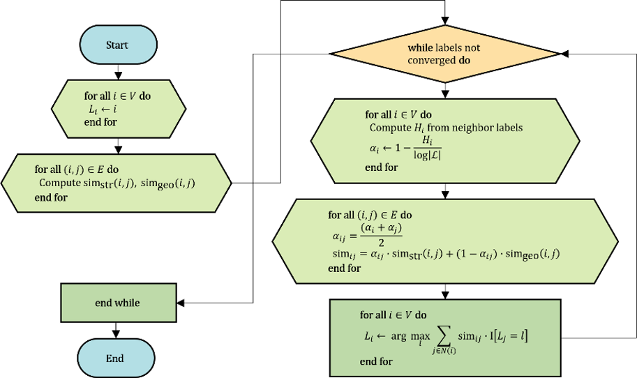
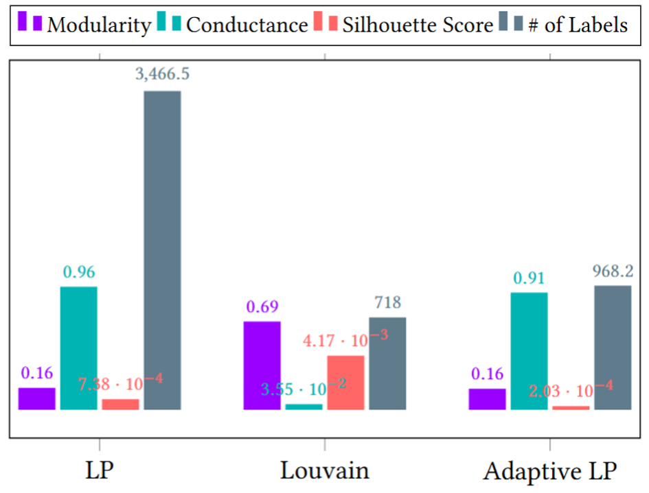
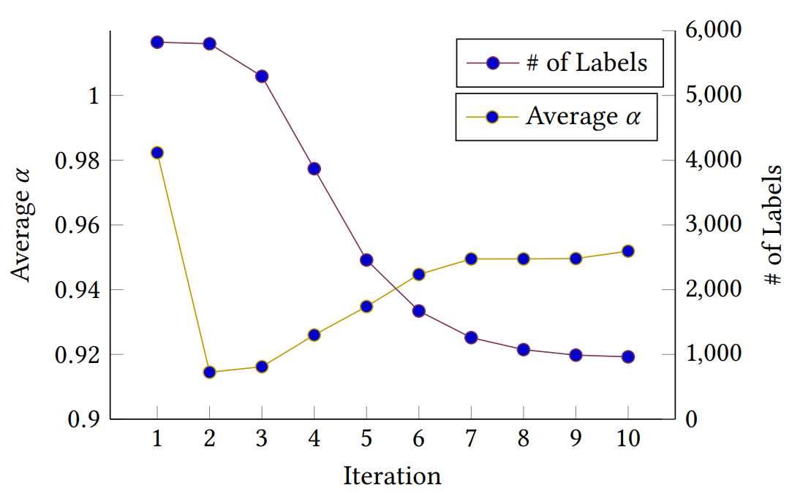
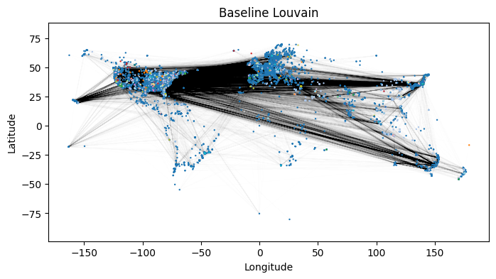
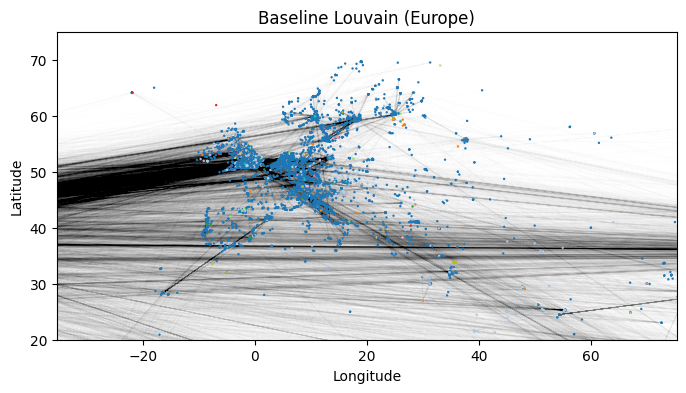
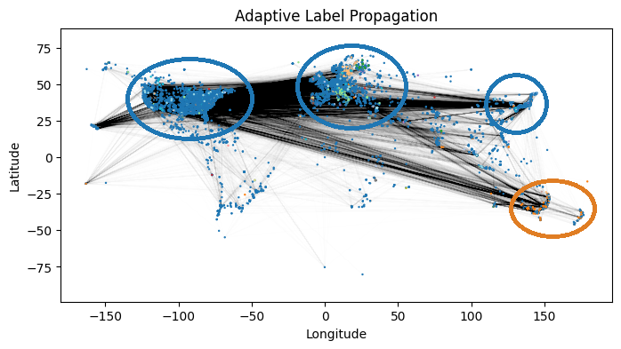
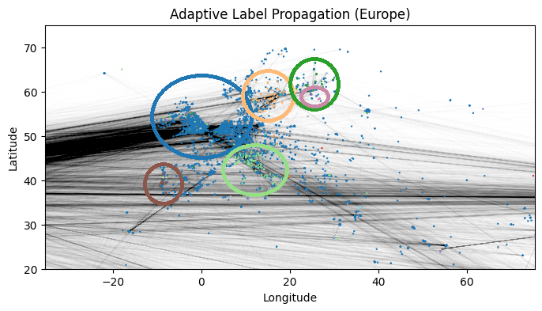

# Adaptive Label Propagation with Entropy-Guided Weighting for Location-Aware Graph Clustering

This repository contains the code and resources for the paper:

> **Adaptive Label Propagation with Entropy-Guided Weighting for Location-Aware Graph Clustering**  
> Doyeol Oh (UNIST)

## Introduction

- Traditional graph clustering (e.g., LP, Louvain) uses only structure, often ignoring spatial coherence.
- Location-based networks provide rich spatial signals via check-ins, but prior methods rely on heavy models.
- We propose a lightweight, training-free method that adaptively fuses structure and location using entropy-based weighting.
- Local label uncertainty guides dynamic adjustment between topological and spatial similarity.

### Limitation of Structure-Only Methods

|  |  |
| :----------------------------------------------: | :----------------------------------------------: |

Structure-only methods link distant users, ignoring local community boundaries

## Main Contributions

- 🧭 **Entropy-guided Weighting** : Balances structure and location using local label entropy.
- 📍 **Recent Check-in Only** : Uses latest location to avoid trajectory modeling.
- 📊 **Coherent Clustering** : Quantitative and visual gains on Brightkite dataset.
- ⚙️ **Training-free & Scalable**: No learning phase; fits low-resource settings.

## Related Work

🧱 **Key Limitations in Prior Work**

- **Structure-only**: Methods like Label Propagation (LP) and Louvain ignore node context and spatial information.
- **GNN-based**: Require node features, labels, and training, making them resource-intensive.
- **Location-aware**: Often depend on user trajectories and end-to-end models, increasing complexity.

🌈 **In contrast, our approach:**

- **Adaptive LP**: Training-free, unsupervised, and uses entropy-based fusion of structure and location without requiring labels or trajectories.

### Comparison Table

| Method                 | Structure | Location | Training | Scalability |
| ---------------------- | :-------: | :------: | :------: | :---------: |
| Label Propagation      |    ✅     |    ❌    |    ❌    |     ✅      |
| Louvain                |    ✅     |    ❌    |    ❌    |     ✅      |
| GNN-based              |    ✅     |    ✅    |    ✅    |     ❌      |
| **Ours (Adaptive LP)** |    ✅     |    ✅    |    ❌    |     ✅      |

## Problem Statement

Given a social graph \( G = (V, E) \) and each user's most recent check-in location \( \mathbf{l}\_i \), the goal is to cluster users by combining structural proximity and spatial locality, without relying solely on node features or labels.

### ⚖️ Hybrid Similarity Function

To fuse structure and location, we define a hybrid similarity for each edge \((i, j)\):

\[
\mathrm{sim}_{ij} = \alpha_{ij} \cdot \mathrm{sim}_{\mathrm{str}}(i, j) + (1 - \alpha_{ij}) \cdot \mathrm{sim}\_{\mathrm{geo}}(i, j)
\]

- \( \mathrm{sim}\_{\mathrm{str}}(i, j) \): Jaccard similarity between neighbors of \(i\) and \(j\)
- \( \mathrm{sim}\_{\mathrm{geo}}(i, j) \): Cosine similarity of location vectors \( \mathbf{l}\_i, \mathbf{l}\_j \)
- \( \alpha\_{ij} = \frac{\alpha_i + \alpha_j}{2} \): Adaptive weight based on local entropy

### 🌡️ Entropy-Guided Weight

Each node \(i\) computes local label entropy at each iteration:

\[
H*i = -\sum*{l \in \mathcal{L}} p_i(l) \log p_i(l)
\]
\[
\alpha_i = 1 - \frac{H_i}{\log |\mathcal{L}|}
\]

- Low entropy (\(H_i \to 0\)): Clear structural signal → higher reliance on graph topology (\(\alpha_i \to 1\))
- High entropy (\(H_i \to \log |\mathcal{L}|\)): Ambiguous structure → shift focus to spatial similarity (\(\alpha_i \to 0\))

## Algorithm Steps

1. **Initialize**: Assign a unique label to each node.
2. **Precompute**: Calculate pairwise structural similarity \( \mathrm{sim}_{\mathrm{str}}(i, j) \) and spatial similarity \( \mathrm{sim}_{\mathrm{geo}}(i, j) \).
3. **Iterative Update** (for each node at every iteration):
   - Compute entropy \( H_i \) over neighbor labels.
   - Derive adaptive weight \( \alpha*i \) and hybrid similarity \( \mathrm{sim}*{ij} \).
   - Update label by weighted majority vote.
4. **Repeat** until label assignments converge.

The label update rule:
\(
L*i^{(t+1)} = \arg\max*{l \in \mathcal{L}} \sum*{j \in N(i)} \mathrm{sim}*{ij} \cdot \mathbb{I}[L_j^{(t)} = l]
\)



See the paper for full pseudocode and mathematical details.

## Experiment

### 📂 Dataset: Brightkite

- 58K users, 214K mutual edges
- 4.5M check-ins (only most recent per user used)
- No trajectory modeling; preserves spatial context

### 🧪 Baselines

- **Label Propagation (LP):** Structure-only label diffusion
- **Louvain:** Hierarchical modularity optimization

### 🎯 Metrics

- **Modularity:** Intra-cluster density vs. random chance
- **Conductance:** Sharpness of cluster boundaries
- **Silhouette Score:** Spatial compactness and separation
- **# of Labels:** Cluster granularity (over-/under-segmentation)

### 📊 Result

All metrics are averaged over 10 independent runs to ensure consistency and reduce variance across methods.



- **Modularity & Conductance:**  
  ALP matches LP in modularity and conductance, but offers stronger inter-cluster connectivity with fewer isolated groups.

- **Spatial Coherence vs. Silhouette:**  
  Though ALP records a lower silhouette score, it excels in producing geographically aligned clusters—showing its strength in balancing spatial and structural signals.

- **Cluster Granularity:**  
  ALP finds a middle ground in cluster count, mitigating LP’s excessive fragmentation (~3466 clusters) and Louvain’s over-merging (~718 clusters) by maintaining moderate granularity (~968 clusters).

## Computational Efficiency


- ⏱️ **Runtime**  
  ALP requires more time (553.5s) due to iterative entropy and similarity computations.

- 💾 **Memory**  
  Remains lightweight (29.4MB), comparable to LP and significantly more efficient than Louvain (95.1MB).

- 💡 **Insight**  
  Suitable for large-scale or resource-constrained environments where memory and responsiveness matter.

## Adaptive Weighting Behavior



- 🏷️ **# of Labels**  
  Drops rapidly from 5822 to 963, showing fast convergence.

- 📈 **Average 𝛼**  
  Decreases early (favoring spatial similarity), then rises as structural confidence grows.

- 💡 **Insight**  
  Confirms ALP’s adaptive fusion of structure and location over time.

## Spatial Coherence Visualization

### Baseline Methods

|  |  |
| :------------------------------------------: | :------------------------------------------: |
|  |  |

**LP / Louvain**: Structure-only methods group distant users, producing fragmented clusters.

### Adaptive LP

|  |  |
| :------------------------------------------: | :------------------------------------------: |

**ALP**: Leverages recent check-ins + entropy-guided weighting to form compact, localized communities.

|  |  |
| :--------------------------------------------------------: | :--------------------------------------------------------: |

**ALP (Marked):** Highlights how ALP captures regional (city-level) structures with clear, spatially coherent clusters.

## Conclusion

We proposed a lightweight, unsupervised method that fuses structure and location via entropy-guided weighting.

- 🏆 **Strengths**

  Interpretable, scalable, and spatially coherent without training.

- 🚀 **Future work**

  1.  Use full trajectory data for spatiotemporal clustering
  2.  Incorporate uncertainty metrics beyond entropy
  3.  Extend to streaming/dynamic social graphs

## Paper

The full paper (including algorithm, experiments, and figures) is available in this repository, [here](report/report.pdf).

## Citation

If you use this code or ideas, please cite:

```
@inproceedings{oh2024locationaware,
  title={Adaptive Label Propagation with Entropy-Guided Weighting for Location-Aware Graph Clustering},
  author={Doyeol Oh},
  booktitle={Conference acronym 'XX'},
  year={2025}
}
```

## License

This project is licensed under the MIT License.

---

For questions or feedback, please contact [ohdoyoel@unist.ac.kr](mailto:ohdoyoel@unist.ac.kr).
